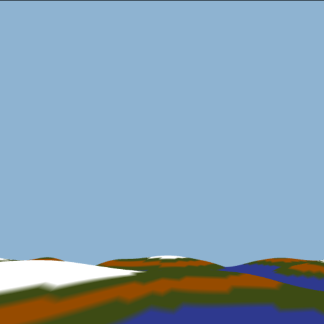
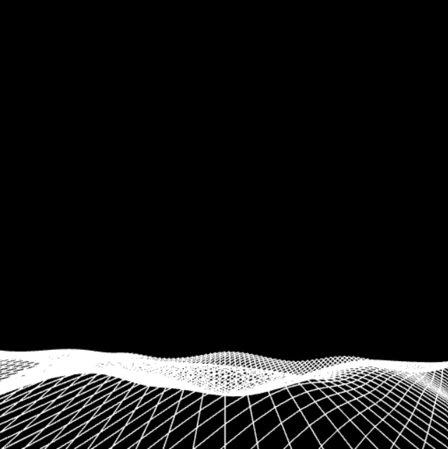
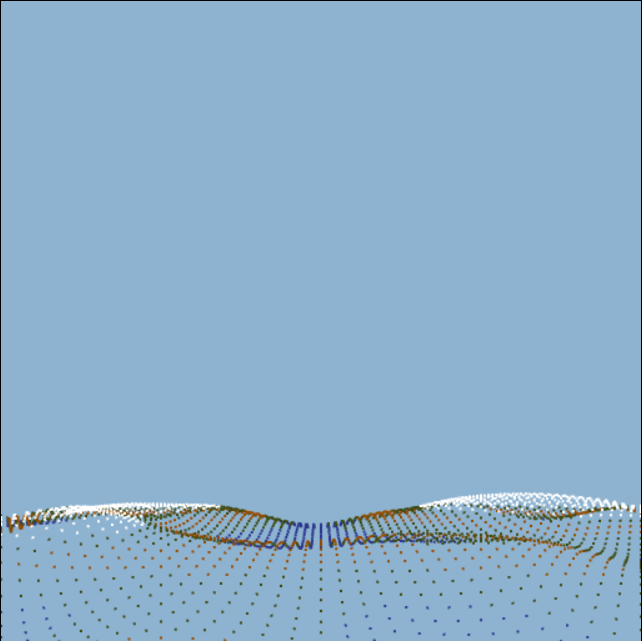

# Flight Simulator

## Introduction
This flight simulator was designed as part of the course **CS 440 Computer Graphics** at **Habib University, Karachi**. The simulator is designed to be a simple flight simulator with a few controls and a simple environment. The simulator is designed using **WebGL** and **JavaScript**.

## Controls
The simulator has the following controls:
- **W**: Pitch up
- **S**: Pitch down
- **A**: Yaw left
- **D**: Yaw right
- **Q**: Roll left
- **E**: Roll right
- **Up Arrow**: Increase speed
- **Down Arrow**: Decrease speed
- **C**: Switch shader
- **V**: Switch viewing mode
- **R**: Reset the plane to its initial position
- **Esc**: Exit the simulator

## Viewing Models
The simulator has three viewing models:
- *Triangle*: The simulator renders the plane as triangles.
- *Wireframe*: The simulator renders the plane as a wireframe.
- *Point*: The simulator renders the plane as points.

## Shaders
The simulator has two shaders:
- *Phong Shader*
- *Flat Shader*
- *Smooth Shader*

## Terrain
The terrain is generated using a height map. The height map is a 2D array of values between 0 and 1. The simulator uses the height map to generate a terrain. [Perlin noise](http://git.io/perlin.js) is used to generate the height map.

## Usage
Clone the repository and run the following command in the root directory of the repository:
```
python -m http.server
```
Then open the following URL in your browser:
http://localhost:8000/simulator.html

## Screenshots
Following are some screenshots of the simulator:
<figure>
    
    <figcaption>Viewing Mode: Triangles, Shader: Phong</figcaption>
</figure>

<figure>
    
    <figcaption>Viewing Mode: Wireframe, Shader: Phong</figcaption>
</figure>

<figure>
    
    <figcaption>Viewing Mode: Point, Shader: Phong</figcaption>
</figure>

## Acknowledgements
- [Perlin noise](http://git.io/perlin.js)
- [WebGL2 Fundamentals](https://webgl2fundamentals.org/)
- [Dr. Waqar Saleem](https://habib.edu.pk/SSE/dr-waqar-saleem/)

## Authors
- [Ali Asghar Chakera](https://github.com/aliasgharchakera)
- [Mustafa Sohail](https://github.com/Mustafasohail7)